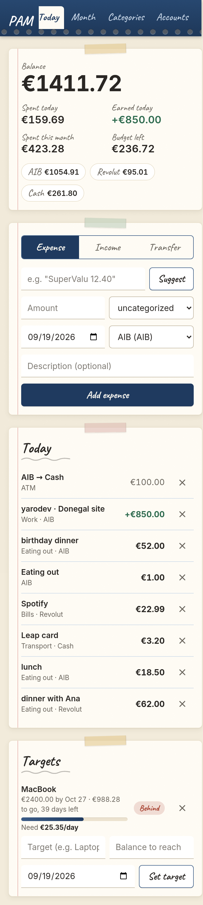
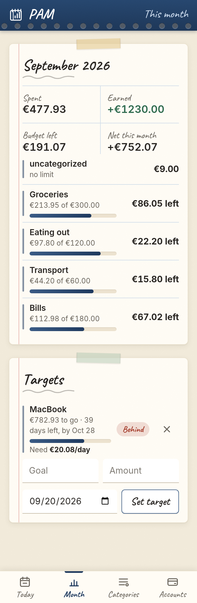
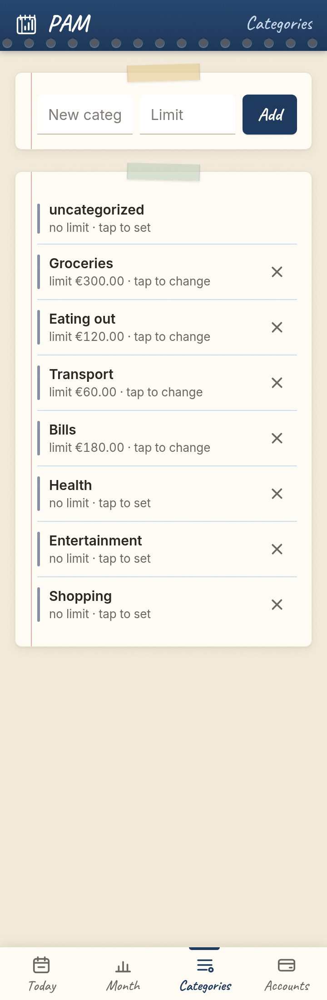

# Personal Finance Tracker

Self-hosted expense tracker with an API-first backend, LLM-based expense categorization, and a daily summary endpoint built as a frozen contract for an Android home-screen widget.

Type "SuperValu €12.40", get back `Groceries` and `12.40`. Record income, set a monthly limit per category, and the daily summary tells you your balance, what you spent and earned today, and what's left this month.

**Live:** https://pam-u8qh.onrender.com/app/ (mobile web app) and https://pam-u8qh.onrender.com/docs (API). Free tier: the first request after 15 idle minutes takes about a minute to wake.

<p>
  
  
  
</p>

## Stack

| Layer | Choice | Why |
|---|---|---|
| API | FastAPI, Python 3.12 | Typed request/response models, OpenAPI docs for free |
| ORM | SQLModel (SQLAlchemy + Pydantic) | One class per table doubles as the validation schema |
| Database | PostgreSQL 16 in Docker, psycopg2, Alembic | Named volume; schema changes are versioned migrations run at startup |
| Auth | OAuth2 password flow, JWT (HS256), argon2id hashes | Standard flow, works with the Swagger "Authorize" button |
| LLM | Any OpenAI-compatible chat endpoint | Provider is configuration, not code. Gemini free tier by default |
| Client | Plain HTML/JS served at `/app`, installable PWA | Thin: every action is one API call. No framework, no build step |
| Tests | pytest, 91 tests, real Postgres | Separate `_test` database, LLM faked via dependency override |
| Packaging | Dockerfile + docker-compose | One command from a clean clone |

## Run it

```bash
git clone https://github.com/vldrshvc/PAM.git && cd PAM
cp .env.example .env            # set POSTGRES_PASSWORD, JWT_SECRET, LLM_API_KEY
docker compose up --build
```

App at http://localhost:8000/app/, interactive API docs at http://localhost:8000/docs.

`JWT_SECRET` must be at least 32 characters (`python -c "import secrets; print(secrets.token_hex(32))"`). `LLM_API_KEY` is optional: without it everything works except `POST /categorize`, which returns 503.

For local development without the API container:

```bash
docker compose up -d db
python -m venv .venv && source .venv/bin/activate
pip install -r requirements-dev.txt
uvicorn app.main:app --reload
pytest
```

## Try it

```bash
curl -X POST localhost:8000/register -H 'Content-Type: application/json' \
  -d '{"username": "vlad", "password": "correct horse battery"}'
# {"id":1,"username":"vlad"}

TOKEN=$(curl -s -X POST localhost:8000/token -d 'username=vlad&password=correct horse battery' \
  | python3 -c 'import sys,json;print(json.load(sys.stdin)["access_token"])')
AUTH="Authorization: Bearer $TOKEN"

curl -X PATCH localhost:8000/categories/2 -H 'Content-Type: application/json' -H "$AUTH" \
  -d '{"monthly_limit": 300}'
# {"name":"Groceries","monthly_limit":"300.00","id":2}

curl -X POST localhost:8000/categorize -H 'Content-Type: application/json' -H "$AUTH" \
  -d '{"text": "SuperValu €12.40"}'
# {"category":{"name":"Groceries","monthly_limit":"300.00","id":2},"amount":"12.40","fell_back":false}

curl -X POST localhost:8000/expenses -H 'Content-Type: application/json' -H "$AUTH" \
  -d '{"price": 12.40, "date": "2026-09-08", "description": "SuperValu", "category_id": 2}'
# {"price":"12.40","date":"2026-09-08","description":"SuperValu","id":1,"category_id":2,"status":"confirmed"}

curl -H "$AUTH" "localhost:8000/summary/daily?tz=Europe/Dublin"
# {"date":"2026-09-08","spent_today":"12.40","spent_this_month":"12.40","budget_total":"300.00",
#  "remaining_total":"287.60","over_budget":false,"categories":[{"id":2,"name":"Groceries",...}]}
```

## Mobile app

`/app/` is a single-page client in `app/static/`: log in, type "SuperValu 12.40", tap Suggest, confirm the category, add. Switch to Income to record money in. Balance and today's totals on top, today's list with delete, the month's spend and earnings against limits, category management, and an opening balance so the number matches your real account. It stores the JWT in `localStorage` and sends the device timezone with every summary call.

Install on Android: open the URL in Chrome → menu → **Add to Home screen**. The manifest sets `display: standalone`, so it opens full-screen without browser chrome.

## API

All routes except `/health`, `/register` and `/token` require `Authorization: Bearer <token>` and only ever return the caller's own data.

| Method | Path | Purpose |
|---|---|---|
| GET | `/health` | Liveness probe |
| POST | `/register` | Create a user; seeds their default categories |
| POST | `/token` | OAuth2 password form, returns a JWT |
| GET, POST | `/expenses` | List (filters: `date_from`, `date_to`, `category_id`) / create |
| GET, PATCH, DELETE | `/expenses/{id}` | Read / partial update / delete |
| GET, POST | `/incomes` | List (filters: `date_from`, `date_to`, `source`) / create. Source is one of `work`, `friend`, `debt`, `bonus`, `other` |
| GET, PATCH, DELETE | `/incomes/{id}` | Read / partial update / delete |
| GET, PATCH | `/me` | Profile with `opening_balance`; PATCH sets it (may be negative) |
| GET | `/balance` | `opening_balance + income_total - expense_total`, all time |
| GET, POST | `/categories` | List / create (name unique per user, case-insensitive) |
| PATCH, DELETE | `/categories/{id}` | Set or clear `monthly_limit`, rename / delete (expenses move to `uncategorized`) |
| GET | `/summary/daily?tz=` | Widget contract, see below |
| GET | `/summary/monthly?month=YYYY-MM&tz=` | Spend vs limit for every category |
| POST | `/categorize` | Free text in, `{category, amount, fell_back}` out; never writes |

Money is always a JSON string with two decimals (`"12.40"`), backed by `NUMERIC(10,2)` and Python `Decimal`. Floats never touch a price.

## Architecture

```
app/
├── main.py            FastAPI instance, lifespan (wait for DB, run migrations), router registration
├── config.py          Settings from environment; the only module that reads os.environ
├── database.py        Engine, per-request Session dependency, wait_for_db() with backoff
├── models.py          SQLModel tables: User, Category, Expense, Income
├── schemas.py         Request/response bodies, including the frozen summary shapes
├── security.py        argon2 hashing, JWT encode/decode, get_current_user dependency
├── llm.py             One chat call against an OpenAI-compatible endpoint; SDK errors → LLMUnavailableError
├── routers/           HTTP only: auth, account, expenses, incomes, categories, summary, categorize
├── services/          budget maths and categorization (pure, no I/O); ledger (income/expense/balance queries)
└── static/            Mobile web client (index.html, app.js, styles.css, manifest.json)
alembic/               Migrations; env.py points at SQLModel.metadata so autogenerate diffs the models
tests/                 pytest; conftest creates <db>_test, truncates per test, fakes the LLM
```

A request goes router → service → session. Routers own status codes and auth; services own the rules and take plain values, which is what makes them unit-testable without a database.

**Decisions worth knowing**

- **Startup waits for Postgres properly.** `wait_for_db()` runs `SELECT 1` with exponential backoff until a deadline, because a container that has "started" is not one that accepts connections. `pool_pre_ping` on the engine means a Postgres restart costs one reconnect, not a 500.
- **The model never gets the last word.** `/categorize` sends the user's live category names and a prompt that allows exactly one of them back. The answer is matched exactly, case-insensitively, against that same list. No fuzzy matching: anything else becomes `uncategorized` with `fell_back: true`. The endpoint returns a suggestion and writes nothing.
- **LLM provider is an environment variable.** `LLM_BASE_URL` + `LLM_MODEL` + `LLM_API_KEY` against any OpenAI-compatible endpoint. Gemini, Groq, OpenRouter and Anthropic are all a `.env` edit.
- **Budget arithmetic only counts budgeted categories.** `remaining_total` is the sum of limits minus spending in categories that have a limit. Spending in an unbudgeted category is reported but cannot eat a budget that was never set.
- **"Today" belongs to the client.** The widget sends its IANA timezone; the server never guesses. Totals roll over at the user's midnight, not the server's.
- **Per-user isolation returns 404, not 403.** Another user's expense or category reads as "not found", so the API doesn't confirm that other people's data exists.
- **Schema changes are migrations, applied on startup.** The lifespan runs `alembic upgrade head`, so a deploy that adds a column just works against a database that already has data. The first revision is a no-op on databases that predate migrations, and a test asserts that autogenerate against the migrated schema produces an empty diff, so models and migrations can't drift.
- **Registration is one transaction.** The user row is flushed, their default categories (including the protected `uncategorized`) are inserted, then a single commit. No user can exist without a fallback category.

## Widget contract: `GET /summary/daily`

This is the only endpoint the widget calls, so its shape is frozen: fields may be added, never renamed or removed. All money values are strings with exactly two decimal places.

```
GET /summary/daily?tz=Europe/Dublin
```

| Query | Required | Meaning |
|---|---|---|
| `tz` | no (default `UTC`) | IANA timezone of the device. "Today" and "this month" are computed in this zone. Unknown zone → 422. |

```json
{
  "date": "2026-09-08",
  "timezone": "Europe/Dublin",
  "spent_today": "96.40",
  "spent_this_month": "296.40",
  "budget_total": "400.00",
  "remaining_total": "119.50",
  "over_budget": false,
  "categories": [
    {"id": 2, "name": "Groceries", "monthly_limit": "300.00", "spent": "165.50", "remaining": "134.50", "over_budget": false},
    {"id": 3, "name": "Eating out", "monthly_limit": "100.00", "spent": "115.00", "remaining": "-15.00", "over_budget": true}
  ]
}
```

| Field | Meaning |
|---|---|
| `date` | Today in `timezone`. |
| `spent_today` | Sum of confirmed expenses dated today, all categories. |
| `spent_this_month` | Sum of confirmed expenses in the current month, all categories. |
| `budget_total` | Sum of `monthly_limit` over categories that have one. |
| `remaining_total` | `budget_total` minus spending in budgeted categories only. Negative when over. |
| `over_budget` | `remaining_total < 0`. |
| `categories` | Only categories with a `monthly_limit`, in id order. `remaining` may be negative. |
| `earned_today` | Sum of incomes dated today. Added later; additions are allowed, renames are not. |
| `earned_this_month` | Sum of incomes in the current month. |
| `balance` | `opening_balance + all income - all confirmed expenses`. |

Pending (auto-ingested, unconfirmed) expenses are excluded from every total. `GET /summary/monthly` returns the same per-category shape for every category, with `remaining: null` where there is no limit, plus `earned_total` and `balance`.

## Database migrations

Schema is versioned with Alembic. The app applies pending migrations when it starts, so deploying is enough. To change the schema:

```bash
# 1. edit app/models.py
# 2. generate the migration from the diff between models and your database
alembic revision --autogenerate -m "add accounts"
# 3. read the generated file in alembic/versions/, then apply it
alembic upgrade head
```

`alembic check` reports whether models and migrations are in sync; the test suite asserts the same.

## Tests

```bash
pytest
```

91 tests in about 5 seconds. They run against a real PostgreSQL database named `<your db>_test`, created on first run and truncated after every test, so nothing is mocked at the database layer. The LLM client is replaced through FastAPI's `dependency_overrides` with a fake whose answer each test scripts. The budget maths and the categorization fallback have dedicated pure-function tests because that's where the logic lives, and a migration test runs every revision against an empty database and checks the result matches the models.

## Configuration

| Variable | Required | Notes |
|---|---|---|
| `DATABASE_URL` | yes | `postgres://` and `postgresql://` are accepted and normalized to the psycopg2 dialect |
| `POSTGRES_USER`, `POSTGRES_PASSWORD`, `POSTGRES_DB` | for compose | Used by the `db` service and to build the API container's `DATABASE_URL` |
| `JWT_SECRET` | yes | Minimum 32 characters; the app refuses to start otherwise |
| `JWT_ALGORITHM` | no | Default `HS256` |
| `ACCESS_TOKEN_EXPIRE_MINUTES` | no | Default 43200 (30 days; the widget has no refresh flow) |
| `LLM_API_KEY` | no | Without it `/categorize` returns 503 |
| `LLM_BASE_URL`, `LLM_MODEL` | no | Default Gemini; see `.env.example` for Groq, OpenRouter, Anthropic |
| `LLM_TIMEOUT_SECONDS` | no | Default 25. Free-tier providers can be slow; the SDK retries once, so the worst case is double this |
| `DB_STARTUP_TIMEOUT_SECONDS` | no | Default 30 |
| `PORT` | no | Container listen port, default 8000; PaaS hosts set it |

Secrets live in `.env`, which is git-ignored. `.env.example` documents every variable with placeholders.

## Deploy for free (Render + Neon)

The container runs on Render's free web service; the database is a free Neon Postgres, because Render's own free Postgres is deleted after 30 days. Neither needs a card. Render sleeps the service after 15 minutes idle and wakes it on the next request in about a minute.

1. **Database.** https://neon.tech → New project → copy the connection string (`postgresql://...?sslmode=require...`). The app accepts it unchanged.
2. **Service.** https://dashboard.render.com → New → Web Service → connect this GitHub repo, branch `main`. Language: **Docker**. Instance type: **Free**. Health check path: `/health`.
3. **Environment variables.** `DATABASE_URL` (from step 1), `JWT_SECRET` (fresh 32+ chars), `LLM_API_KEY`, `LLM_BASE_URL`, `LLM_MODEL`.
4. Deploy. When the health check is green, `https://<app>.onrender.com/docs` is live (this project: https://pam-u8qh.onrender.com/docs) and the widget points at `https://<app>.onrender.com/summary/daily?tz=Europe/Dublin`.

The container is the same image compose builds locally. Render injects `PORT`; the start command already reads it.

## Roadmap (v2)

- **Auto-ingestion**: Revolut transactions arrive as `status: pending` expenses. The status column and the exclusion of pending rows from totals are already in place.
- **Confirm-and-describe**: push notification to the phone; user confirms, picks a category, adds a description.
- **Widget**: a native Android home-screen widget (Kotlin/Glance) that only ever calls `/summary/daily`.
